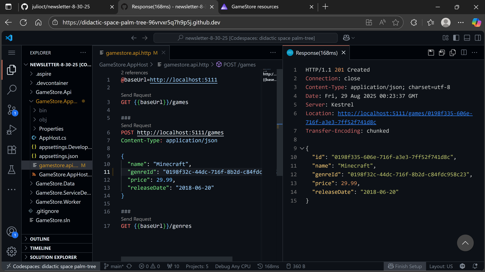

*Read time: 6 minutes*

I've mentioned before how .NET Aspire enables this amazing Clone → F5 experience, which can get every team member up to speed in minutes, no extra configuration required.

But that promise falls apart the moment you're in a constrained dev environment, like in a locked-down corporate laptop, or maybe a client machine where you can't install even Docker Desktop.

**What if the only thing you needed was a browser and a decent Internet connection?**

That's exactly what GitHub Codespaces delivers. Your entire development environment, complete with .NET SDK, Docker, and all the tools your Aspire application needs.

It runs in the cloud and is available from your browser wherever you have an internet connection. No local installs, no IT approval, no "works on my machine" excuses.

Let me show you how it works.

<br>

## What is a GitHub Codespace?

A codespace is a development environment that's hosted in the cloud and that you can customize according to your needs.


Your codespace runs as a Docker container that lives in a Linux VM hosted in Azure. There, you can customize several things, including:

* The specs of the VM
* Which image should the container be based on
* Any tooling or languages you want to enable

Your codespace will be created with a clone of your repository, and you can connect to it using either the standard VS Code desktop app or the web version that runs in a browser.

Now let's see how to create a codespace for a .NET Aspire application.

<br>

## Enabling Codespaces support for your repo

Here I'll use the Aspire application I covered in my [.NET Aspire Tutorial]({{ site.url }}/blog/net-aspire-tutorial-build-production-ready-apps-from-day-1), which includes a PostgreSQL DB, a .NET API, and a .NET worker service.

To get started with Codespaces in your repo, all you need to do is drop in a `devcontainer.json` file in a folder called `.devcontainer`, at your repo root:


<br>

I'll initialize my `devcontainer.json` file with the base image I'll need to work with my .NET apps:

```json
{
    "image": "mcr.microsoft.com/devcontainers/dotnet:9.0-bookworm"
}
```

<br>

That sets up my codespace to run in a Debian 12 "Bookworkm" container that has the full .NET 9 SDK preinstalled, so it is the absolute minimum to prepare an environment for .NET development.

However, we probably want to improve the coding experience by enabling the **C# Dev Kit**, so let's add a small customization for that:

```json{3 4 5 6 7 8 9}
{
    "image": "mcr.microsoft.com/devcontainers/dotnet:9.0-bookworm",
    "customizations": {
        "vscode": {
            "extensions": [
                "ms-dotnettools.csdevkit"
            ]
        }
    }
}
```

<br>

Next, let's also install the **.NET Aspire CLI** so can more easily work with the Aspire solution from the command line.

We can use the `onCreateCommand` property for this, which will run the command immediately after the container starts for the first time:

```json{10}
{
    "image": "mcr.microsoft.com/devcontainers/dotnet:9.0-bookworm",
    "customizations": {
        "vscode": {
            "extensions": [
                "ms-dotnettools.csdevkit"
            ]
        }
    },
    "onCreateCommand": "curl -sSL https://aspire.dev/install.sh | bash"
}
```

<br>

.NET Aspire applications run all local infrastructure services as Docker containers, so you will need the ability to run "containers inside your codespace container".

Pretty cool stuff that's actually easy to enable with a few more lines:

```json{11 12 13}
{
    "image": "mcr.microsoft.com/devcontainers/dotnet:9.0-bookworm",
    "customizations": {
        "vscode": {
            "extensions": [
                "ms-dotnettools.csdevkit"
            ]
        }
    },
    "onCreateCommand": "curl -sSL https://aspire.dev/install.sh | bash",
    "features": {
        "ghcr.io/devcontainers/features/docker-in-docker:2": {}
    }
}
```

<br>

You may also want to specify the specs of your VM, so let's go for a combination that should be pretty good to start:

```json{14 15 16 17 18}
{
    "image": "mcr.microsoft.com/devcontainers/dotnet:9.0-bookworm",
    "customizations": {
        "vscode": {
            "extensions": [
                "ms-dotnettools.csdevkit"
            ]
        }
    },
    "onCreateCommand": "curl -sSL https://aspire.dev/install.sh | bash",
    "features": {
        "ghcr.io/devcontainers/features/docker-in-docker:2": {}
    },
    "hostRequirements": {
        "cpus": 8,
        "memory": "32gb",
        "storage": "64gb"
    }
}
```

<br>

And, lastly, as a handy convenience, let's trust the HTTP development certificate (included with .NET SDK) so we don't get security warnings in the browser:

```json{11}
{
    "image": "mcr.microsoft.com/devcontainers/dotnet:9.0-bookworm",
    "customizations": {
        "vscode": {
            "extensions": [
                "ms-dotnettools.csdevkit"
            ]
        }
    },
    "onCreateCommand": "curl -sSL https://aspire.dev/install.sh | bash",
    "postStartCommand": "dotnet dev-certs https --trust",
    "features": {
        "ghcr.io/devcontainers/features/docker-in-docker:2": {}
    },
    "hostRequirements": {
        "cpus": 8,
        "memory": "32gb",
        "storage": "64gb"
    }
}
```

<br>

`postStartCommand` will run each time the container is successfully started, so it should work fine for this purpose.

There's plenty more you can configure here, especially in terms of the extensions you'd like enabled for your codespace, but this should be a good start.

Now, let's commit and push the new file to the remote GitHub repo so we can create our first codespace.


<br>

## Using codespaces in the browser

You can work with codespaces either in your local VS Code desktop app or directly in the browser. Let's try this second approach first.

To create the codespace, browse to your GitHub repo, go to the **Codespaces** tab in the **Code** dialog, and click **Create codespace on main**:


<br>

A new tab will open with the browser version of VS Code and your repo opening on it (can take a few minutes, depending on the size of your base image and the startup tasks you have defined):


<br>

What you have here is a complete dev environment ready for you to work on all aspects of your app.

In fact, you can run your app right away with the **.NET Aspire CLI**:


<br>

And you can click on the provided link to get to your Aspire dashboard:


<br>

To test your API, you can use the same `.http` file you've been using locally:



<br>

## Using codespaces in VS Code desktop

You don't have to go to the browser to use your codespaces. You can still use your regular VS Code desktop app, but work in an entirely virtualized dev environment.

On any VS Code instance that has access to GitHub, start by installing the **GitHub Codespaces** extension:


<br>

Now switch to the **Remote Explorer**, sign in to GitHub if asked to, find your existing codespace from the list (you can create new ones too), and click on the **Connect** button:


<br>

Your codespace opens, just as if it were a local repo in your box, but it's all running in a dev environment in the cloud.


<br>

Mission accomplished!

<br>

## Wrapping Up

GitHub Codespaces eliminates the last barrier to .NET Aspire's promise of universal development environments.

No more onboarding documents that start with "First, make sure you have Docker Desktop installed."

Your application model becomes the single source of truth for both local development and cloud deployment, regardless of what machine someone happens to be using.

When setup becomes invisible, teams focus on what actually matters: shipping features that customers love.

And that's it for today.

See you next Saturday.


---

<br>

**Whenever you’re ready, there are 3 ways I can help you:**

1. **[.NET Backend Developer Bootcamp]({{ site.url }}/courses/dotnetbootcamp)**: A complete path from ASP.NET Core fundamentals to building, containerizing, and deploying production-ready, cloud-native apps on Azure.

2. **​[Building Microservices With .NET](https://dotnetmicroservices.com)**: Transform the way you build .NET systems at scale.

3. **​[​Get the full source code](https://www.patreon.com/juliocasal){:target="_blank"}**: Download the working project from this article, grab exclusive course discounts, and join a private .NET community.
